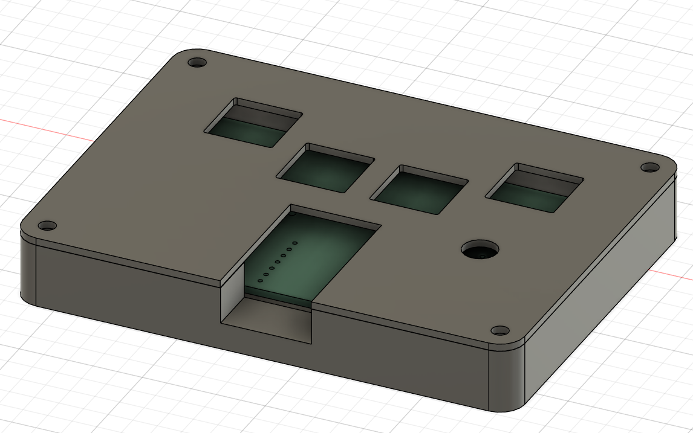
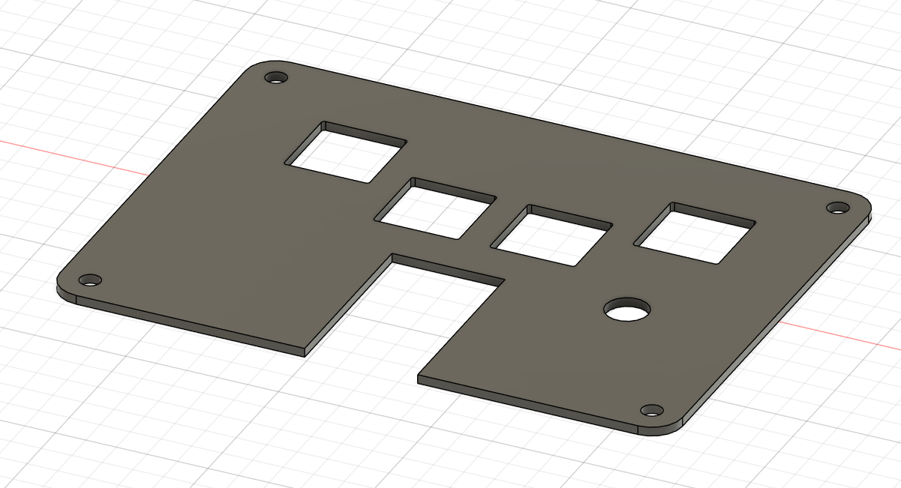
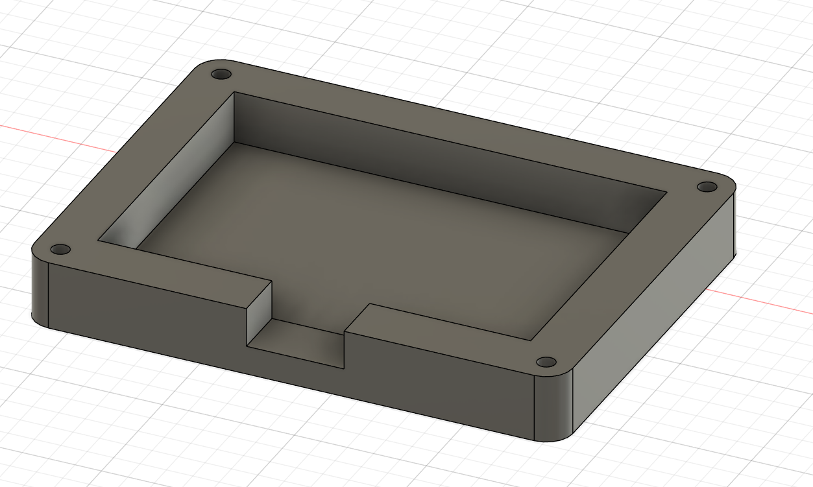
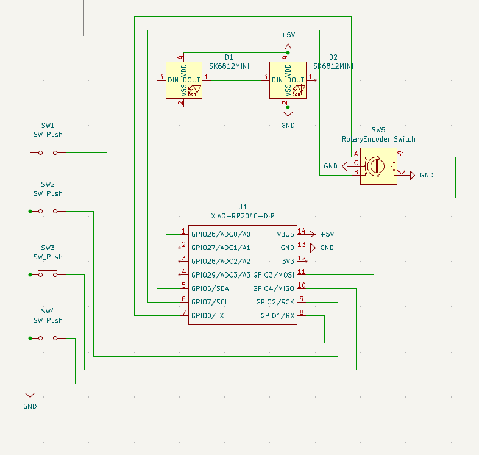
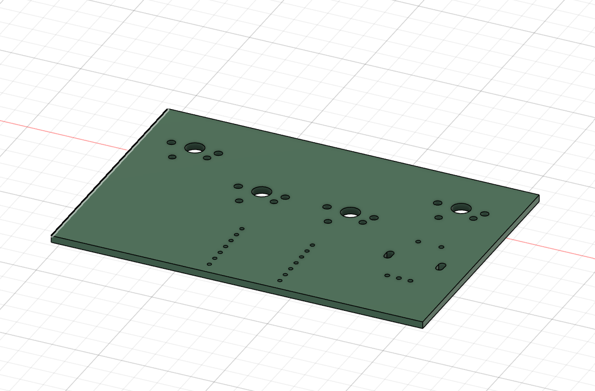
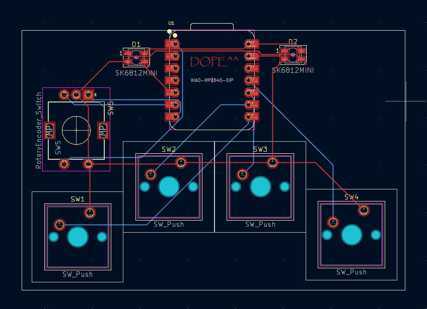

# DOPE-PAD

It is dope for a reason. It is simple and extremely functional. The copy function and paste function is integrated to individual keys along with two slangs in other two keys.
It is a 4-key Macropad with a rotary encoder.

# Features

Microcontroller: Seeed XIAO RP 2040
Firmware: KMK
4-Keys + 2 little LEDs

# Here's the visuals of DOPE-Pad

|  |  |  |
| :---: | :---: | :---: |
| **Macropad** | **Top View** | **Base** |

|  |  |  |
| :---: | :---: | :---: |
| **Schematic** | **PCB Layout** | **Assembled Board** |

| Item                          | Quantity | Description                                   | Source                   |
|-------------------------------|----------|-----------------------------------------------|--------------------------|
| Seeed XIAO RP2040            | 1        | Microcontroller                               | Seeed Studio             |
| Push Buttons (6mm)           | 4        | Tactile push buttons                          | Any Electronics Store     |
| Rotary Encoder                | 1        | Rotary encoder with push button               | Any Electronics Store     |
| SK6812 MINI RGB LEDs          | 2        | Individually addressable RGB LEDs             | Adafruit / Online        |
| Resistors (10kΩ)             | 5        | Pull-up resistors for switches and encoder    | Any Electronics Store     |
| Capacitors (0.1µF)           | 2        | Decoupling capacitors for LEDs                | Any Electronics Store     |
| PCB                           | 1        | Custom PCB for the macropad                  | Fabricated               |
| Micro USB Cable               | 1        | For power and data transfer                   | Any Electronics Store     |
| Soldering Materials           | -        | Solder, flux, and soldering iron             | Any Electronics Store     |

It is very Basic and simple. Desogn-wise and functionality-wise.

Thanks for reading!
